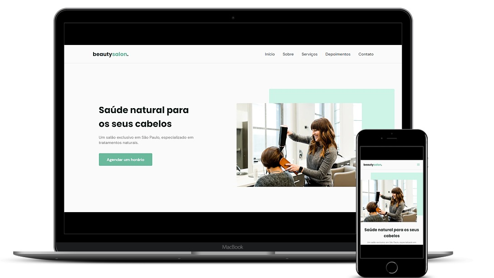

  <a href="#-tecnologias">Tecnologias</a>&nbsp;&nbsp;&nbsp;|&nbsp;&nbsp;&nbsp;
  <a href="#-projeto">Projeto</a>&nbsp;&nbsp;&nbsp;|&nbsp;&nbsp;&nbsp;
  <a href="#-layout">Layout</a>&nbsp;&nbsp;&nbsp;|&nbsp;&nbsp;&nbsp;
  <a href="#memo-licença">Licença</a>

 

  

 

  

## 🚀 Tecnologias

Esse projeto foi desenvolvido com as seguintes tecnologias:

- HTML
- CSS
- JavaScript

Bibliotecas:

- [Google Fonts](https://fonts.google.com)
- [SwiperJS](https://swiperjs.com/)
- [ScrollReveal](https://scrollrevealjs.org/)

## 💻 Projeto

O BeautySalon é uma página que faz alusão a uma empresa fícticia de salão de beleza, onde a mesma foi construida sobre o formato de Landing Page, um site que contém todo o seu conteúdo em uma única página. Além disso, conta com as seguintes seções: Navegação, Home, Sobre, Serviços, Depoimentos, Contato, Rodapé e Responsividade, deixando a aplicação pronta para vários tamanhos de telas.

## 🔖 Layout

Você pode visualizar o layout do projeto completo através [desse link](https://lucasmengue.github.io/nlw-06-origin/).

## :memo: Licença

Esse projeto está sob a licença MIT. Veja o arquivo [LICENSE](.github/LICENSE.md) para mais detalhes.

---

Feito com ♥ by Lucas :wave:
